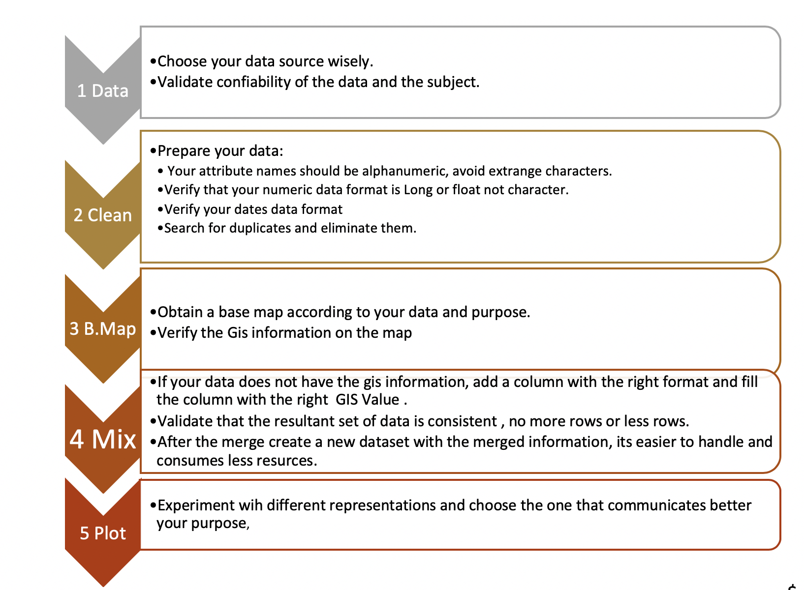
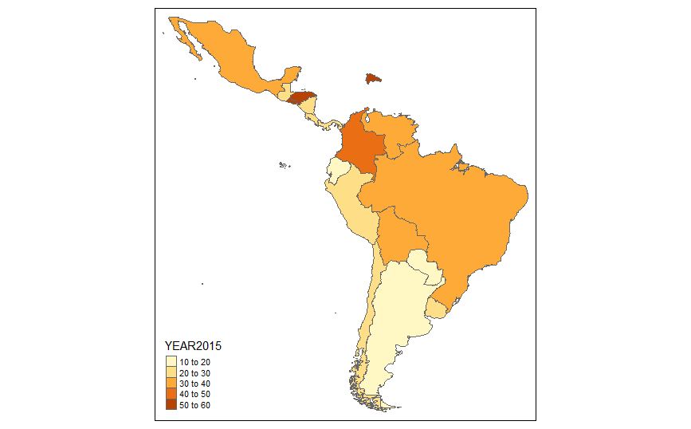
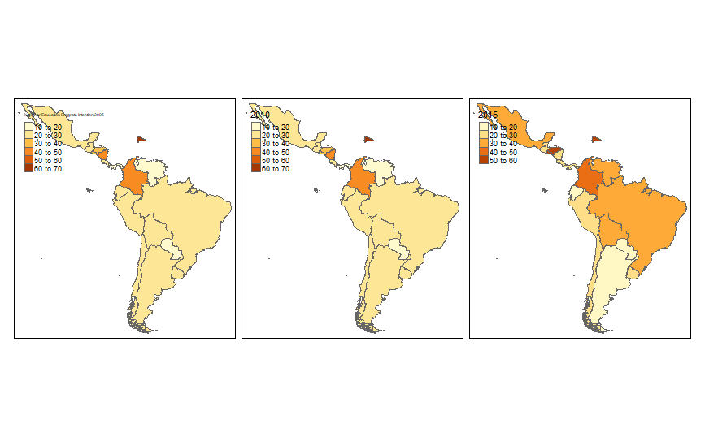
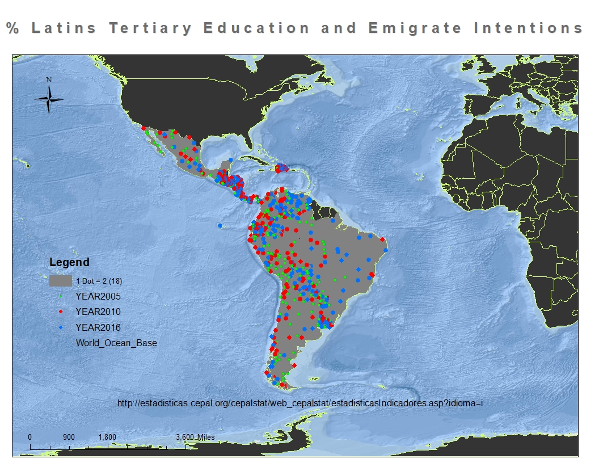

---
#Title: "Assesment 1"
author: "Yanira Rivera"
date: "3 November 2018"
output: html_document:

# First Part - ArcMap and RStudio a Comparative Report
#### Word count 585

This review is based on the maps produced by Arcmap and R-Studio  for the first GIS assignment. Initially we are going to present the workflow followed to build the maps and second we are going to describe the process with each tool and last we are going conclude that both tools has their own advantages and disadvantages and its depending on the individual knowledge and resources to choose which one is suitable for the purpose.

The longest time on the process of building this map was on choose the data. This was obtained from the open source data from CEPAL (2017) about surveys in Latin America on different segments of the population classified by gender, educational level, country and the quantity of how many of these individual had the emigration intention. We choose to present the information for all the countries in Latin America were the survey was made with a focus on Higher Educational level for both genders. The data was exported on a csv file and it was cleaned from other titles and non alphanumeric characters.

First, with Arcmap we used the adminCountries baseMap from Esri and we merged this map with the prepared csv file. We created several maps trying to show the evolution of the quantities over the years. Even though, we had a 10-years period, after several intents decided to choose only 3 years and presented the map with this information only. The process was easy, and the main difficulty was to hope not getting out of resources. Due to the main objective was to present the information over time, the option of Time option was used but was remoreved latetly.

It presented an animation of the change of colors depending of the quantities per year. Although it works, it also hangs very consistently and the configuration lacked of flexibility to change the time window successfully, possible due to the lack of resources. 

To build a map with R-studio was very straight forward. The material at the class it is very clear and help to build the first map fast. The first problem was at the moment of import the data file. The columns after import even though were numerical always were imported as characters avoiding the numerical operations. We changed to another import command and finally it worked well. Building the map was fast and even char to number conversion its easy . RStudio does not requires as much resources as ARCmap but R language knowledge. There are many tutorials on the Internet, still the material given in class was basically enough. Some of the problems like formatting, types, other libraries could be solved at the site library documentation. On the other hand, the tmap library allows the option of an interactive map. But mostly not in the way that we intended. Due to the interaction was based on zooming the map or focusing on another coordinate or changing the base maps as well. Still changing the information over a time frame fluently could not be achieved at this moment. 

In summary , both tools have their own advantages. It is depending on the individual use, knowledge and resources available that it will help to decide which one is more suitable for the purpose. We should say that R-Studio is an open source tool  at the contrary of ARCmap. Maps can be build  with much less resources than ArcMap and on a very reduced time frame. Nevertheless the resource needed is knowledge about the programming and available libraries to work with.

#Second Part - The maps 
##Rtudio
###1. First we need to set java_home and to load some libraries

###########################################

options(java.home="C:\\Program Files\\Java\\jre1.8.0_191\\")

library("sf")

library("tmap")

> We already have  installed these libraries so we only need to load them

###2. Now we read the shapefile with the data

#####################################################

WBCOPER2 <- st_read("AssesLatv8.shp")

####################################################
####------> we need to validate that the file is ok
######################################################

class(WBCOPER2)

WBCOPER2

###3.  The information seems to be ok, now we plot the first map
#################################################################

tmap_mode("plot")
tm_shape(WBCOPER2) + tm_polygons("YEAR2015")

###4. Now we are going to add more data to compare different years.

tm_shape(WBCOPER2) + tm_fill(col=c("YEAR2010","YEAR2010","YEAR2015"),title=c('% Higher Education Emigrate Intention 2005','2010','2015')) + 
  tm_borders()

  
#################################################
###5.  Maps are presenting the right information. But some adjustments are needed, labels are overlaping the maps and we need to add a general title.
##

tm_shape(WBCOPER2) + tm_fill(col=c("YEAR2005","YEAR2010","YEAR2015")) +
  tm_borders() + tm_layout(panel.labels=c("2005","2010","2015")) +
  tm_legend(legend.position = c("left", "bottom"),main.title = "%Latin Americans with Higher Education & Emigrate Intention", main.title.position = "right")

###6. Final Basic MAP

>------

##ARCMap
>----------------------------
### 1. The layers
###

### 2. Symbology
###

###3. Final Map

>
## References
>
>
Denett, A. (2018). RPubs - Practical 3 - Introduction to using R as a GIS. [online] Rpubs.com. Available at: https://rpubs.com/adam_dennett/427207 [Accessed 3 Nov. 2018].
>
Cran.r-project.org. (2018). tmap: get started!. [online] Available at: https://cran.r-project.org/web/packages/tmap/vignettes/tmap-getstarted.html [Accessed 3 Nov. 2018].
>
Cepal.org. (2018). Data and statistics | Economic Commission for Latin America and the Caribbean. [online] Available at: https://www.cepal.org/en/datos-y-estadisticas [Accessed 3 Nov. 2018].

# Third Part- Assesment 1 , Document uploaded at GITHUB 

> This document
