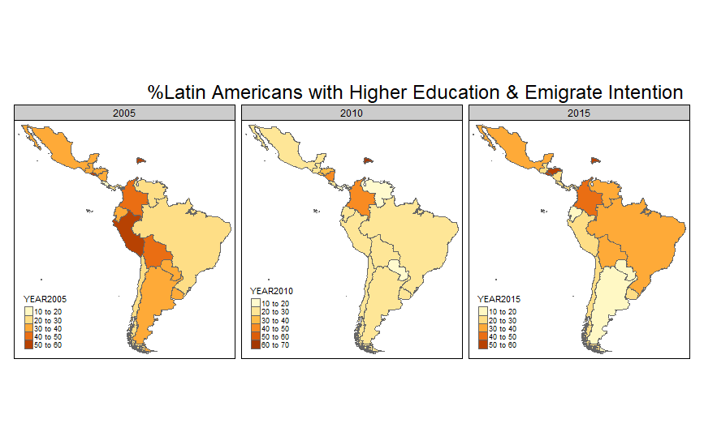
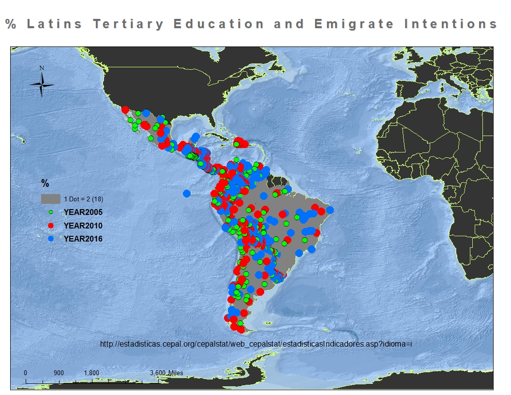

##                                        Assessment Part 1

###1. First we need to set java_home and to load some libraries

###########################################

options(java.home="C:\\Program Files\\Java\\jre1.8.0_191\\")

library("sf")

library("tmap")

> We already have  installed these libraries so we only need to load them

###2_Now we read the shapefile with the data

#####################################################

WBCOPER2 <- st_read("AssesLatv8.shp")

####################################################
####------> we need to validate that the file is ok
######################################################

class(WBCOPER2)

WBCOPER2

###3_ The information seems to be ok, now we plot the first map
#################################################################

tmap_mode("plot")
tm_shape(WBCOPER2) + tm_polygons("YEAR2015")

################################################################################
###4_Now we are going to add more data to compare different years.

tm_shape(WBCOPER2) + tm_fill(col=c("YEAR2010","YEAR2010","YEAR2015"),title=c('% Higher Education Emigrate Intention 2005','2010','2015')) + 
  tm_borders()

  
#################################################
###5_ Maps are presenting the right information. But some adjustments are needed, labels are overlaping the maps and we need to add a general title.

################################################################################
tm_shape(WBCOPER2) + tm_fill(col=c("YEAR2005","YEAR2010","YEAR2015")) +
  tm_borders() + tm_layout(panel.labels=c("2005","2010","2015")) +
  tm_legend(legend.position = c("left", "bottom"),main.title = "%Latinos with Higher Education & Emigrate Intention", main.title.position = "right")

###6_This is the first basic map

##########################################################################

###5.Here is the map created with Arcmap

###References

####  Denett, A. (2018). RPubs - Practical 3 - Introduction to using R as a GIS. [online] Rpubs.com. Available at: https://rpubs.com/adam_dennett/427207 [Accessed 3 Nov. 2018].

####Cran.r-project.org. (2018). tmap: get started!. [online] Available at: https://cran.r-project.org/web/packages/tmap/vignettes/tmap-getstarted.html [Accessed 3 Nov. 2018].

####Cepal.org. (2018). Data and statistics | Economic Commission for Latin America and the Caribbean. [online] Available at: https://www.cepal.org/en/datos-y-estadisticas [Accessed 3 Nov. 2018].

